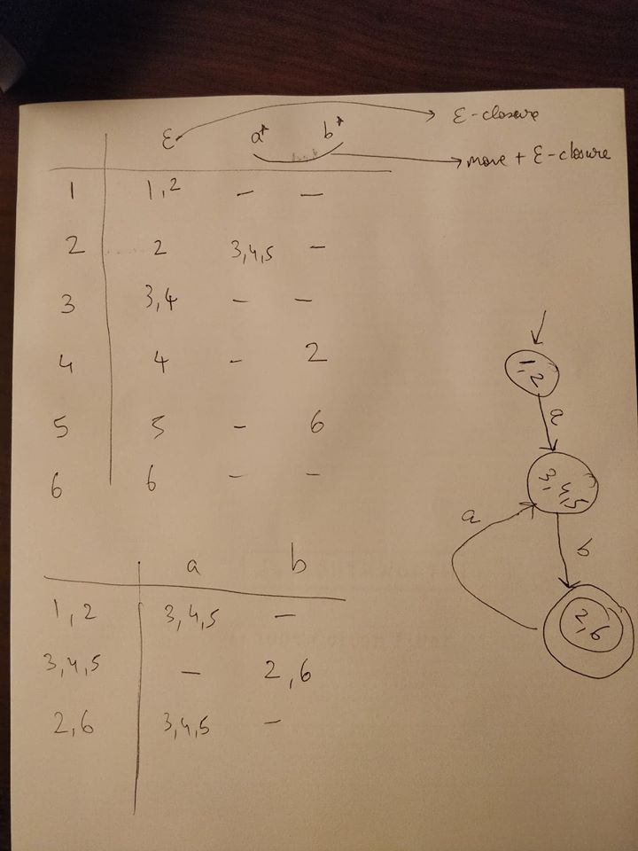

# Discussion 7 - Friday, March 11th
 
## NFA, DFA, and Regex Explanation + Practice 

Worksheet.pdf, Disc 7 - Automata Algorithms.pdf (extra practice)

## NFA Accept
* NFAs vs. DFAs: What's the difference?
    * NFAs can have e transitions.
    * NFAs can have more than 1 transition on the same character from a state.

### Question 1

* Does the NFA accept "abab"?
* Here's how we process things:
    * For DFAs, as we read characters, we track which state we're on.
    * For NFAs, as we read characters, we track which states (PLURAL!) we COULD be on.
* Let's demonstrate:
    * Draw a stick figure on the start state. Let's call him Naruto.
    * Let's start w/ an e-closure.
        * Even before we read a character, we COULD be on any state reachable w/ e transitions.
        * So, Naruto clones himself and puts 1 clone on each state reachable w/ e transitions.
        * (draw the clones)
    * Let's read a character: 'a'
        * Each clone takes an 'a' transition.
            * If more than 1 'a' transitions exist, the clone clones himself and takes both transitions.
            * If no 'a' transitions exist, the clone dies.
            * (draw and erase the clones)
        * Then, we do an e-closure.
            * We do an e-closure after each character we read, cloning for each e-closure.
    * Read the rest of the characters: 'b', 'a', 'b'.
    * We ACCEPT if ANY clone is on ANY final state.
        * A clone on a final state shows that after reading "abab", we COULD be on that state. (The clone DID get to that state w/ "abab", after all.)
    * As we can see, there is a clone on state 6. We ACCEPT the string! 
* *As humans:* We can examine the NFA and find a path to a final state, like we just saw with this example.
* *But for a computer?* Our process is hard to code. (Who knows what our brains are doing!) Later we'll see it would be easier to code after converting to a DFA.

### Hints on NFA accept
- NFA accept is essentially e-closure, move, e-closure, move, ....e-closure. In other words, e-closure, (move, e-closure,)* e-closure.
- This will be key for future projects

## NFA -> DFA conversion
* We will convert the NFA above to a DFA.
* Here's an idea: Let's create a DFA which has a state for each clone formation! In other words:
    * For an NFA w/ states 1, 2, 3, 4, 5, and 6:
    * The DFA has a state for each SUBSET of states we COULD be on.
    * B-b-but aren't there 2^n subsets? Eek!
    * Chill! We just have to account for subsets which represent possible (reachable) formations.
        * For example, our DFA doesn't need a state for {1}. If we COULD be at state 1, we COULD be at state 2, also (via e transition).
    * So, let's start at the first subset {1, 2} (e-closure of the start state) and do transitions over the alphabet and see what subsets actually show up!

## RE -> NFA conversion
* 3 basic operators: concatenation, union, kleene closure
* Convert the following regular expressions to NFAs.
    * ab*|a*|c*
    * c(a|b)*
    * (abc)+ (equivalent to abc(abc)*)
