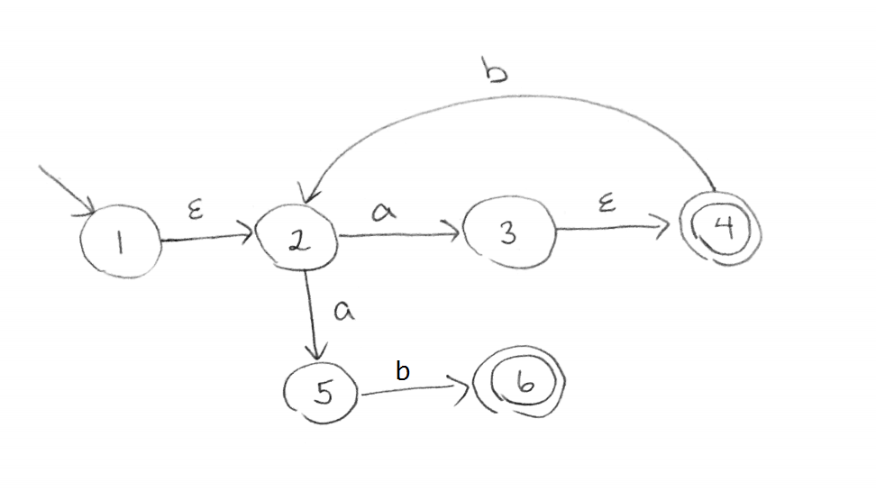
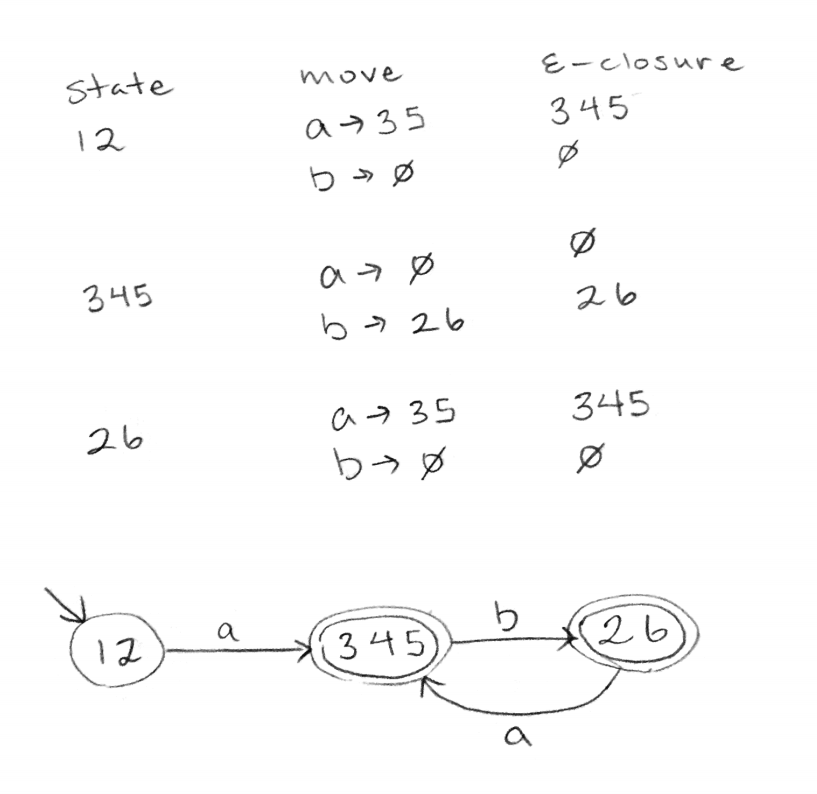

# Discussion 8 - Friday, March 18th

## NFA -> DFA conversion

* We will convert the NFA above to a DFA.
* Here's an idea: Let's create a DFA which has a state for each clone formation! In other words:
    * For an NFA w/ states 1, 2, 3, 4, 5, and 6:
    * The DFA has a state for each SUBSET of states we COULD be on.
    * But aren't there 2^n subsets!?
    * No problem! We just have to account for subsets which represent possible (reachable) formations.
        * For example, our DFA doesn't need a state for {1}. If we COULD be at state 1, we COULD be at state 2, also (via e transition).
    * So, let's start at the first subset {1, 2} (e-closure of the start state) and do transitions over the alphabet and see what subsets actually show up!

## Parsing and Grammars, Explanation
### 1) Terminals, non-terminals and productions
### 2) Practice designing grammars

### 3) Practice derivations
Grammar: S -> S + S | 1 | 2 | 3

Leftmost derivation of 1 + 2 + 3
* Start w/ S and use the production rules on the LEFTMOST nonterminal ONE AT A TIME. (For a rightmost derivation, use the productions on the RIGHTMOST nonterminal.)
* ONE NONTERMINAL AT A TIME!!!! DON'T COMBINE STEPS!!!!
* S -> S + S -> S + S + S -> 1 + S + S -> 1 + 2 + S -> 1 + 2 + 3
* S -> S + S -> 1 + S -> 1 + S + S -> 1 + 2 + S -> 1 + 2 + 3 works too

Note: If there are 2 derivations for the same string, what does that mean? The grammar is ambiguous.
  * To show that a grammar is ambiguous, show 2 different derivations for the same string.
  * It's hard to know whether a grammar is ambiguous or not (it's an undecidable problem afaik). But be suspicious if you see something along the lines of S -> SS, S -> SSS, S -> S+S, etc.
### 4) Parsing with a computer 
The exercise below goes into further detail 

## Coding Excercise (Optional) 
* To go from source code to a running program, there are 3 steps (at least for our purposes):
    * Tokenizing/Lexing (separating text into smaller tokens)
    * Parsing (generating something meaningful from the tokens - an AST)
    * Interpreting (evaluating the result of the AST) 

* Consider the following grammar:
    * S -> M + S | M
    * M -> N * M | N
    * N -> n | (S)
    * where n is any integer

* This grammar is right associative/recursive (Why did we provide a right associative grammar? What would you do if we didn't?)

* What is the relative precedence of the + and \* operators here? How is it determined? How can we use CFGs to enforce precedence?

### Lexer
* Open `lexer.skeleton.ml`.
* Answer key in `lexer.ml`
* Variant type `token`
* Maintain an index that keeps track of where we are in the string, and move forward as we keep tokenizing.
* In P4, you will have to worry about the order in which they have their `if/else` ... `if/else` (certain regexs should be checked before others).
* It's probably also a good idea to just define all the regex's and store in variables at the top.

### Parser
* Open `parser.skeleton.ml`.
* Answer key in `parser.ml`
* Variant type `expr` 
* Note: Use `let rec ...` and to write mutually recursive functions.
* Note: `lookahead` just returns the head of the list.
* Note: `match` just "consumes" the head of the list (provided that the token and head of the list match).
* IMPORTANT: 
    * We're going to write a function named `parse_X` for each nonterminal `X` in our grammar.
    * Each of these functions will parse (consume) some tokens, and return (1) the unparsed tokens and (2) the AST which corresponds to the parsed tokens.

### Interpreter
